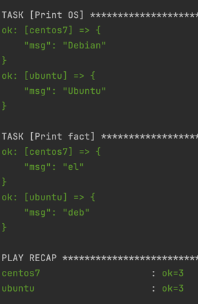
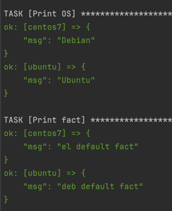
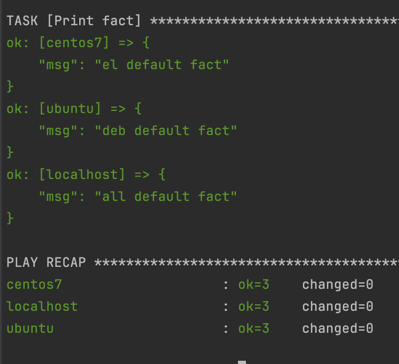

# Основная часть
1. Значение some_fact 12, взято из group_vars/all/examp.yml
2. Значение some_fact в файле group_vars/all/examp.yml и изменено на "all default fact". Playbook выполнился корректно.

