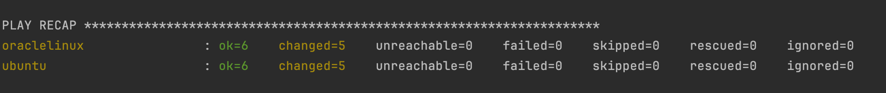
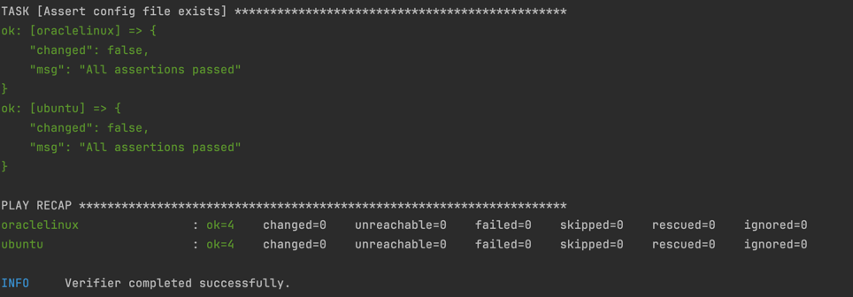
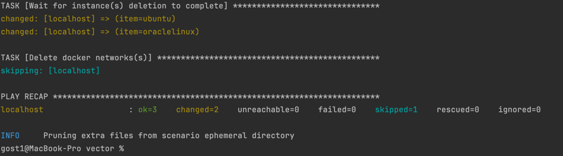
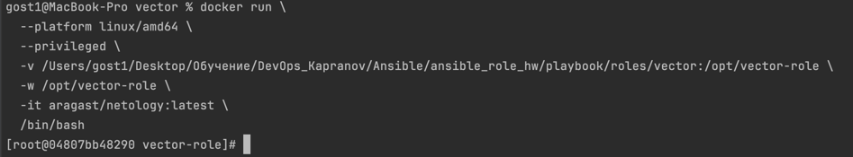

### Molecule
1. Запустите  `molecule test -s ubuntu_xenial` (или с любым другим сценарием, не имеет значения) внутри корневой директории clickhouse-role, посмотрите на вывод команды!
[img.png](img.png)
2. Перейдите в каталог с ролью vector-role и создайте сценарий тестирования по умолчанию при помощи `molecule init scenario --driver-name docker`.
3. Добавьте несколько разных дистрибутивов (oraclelinux:8, ubuntu:latest) для инстансов и протестируйте роль, исправьте найденные ошибки, если они есть.

4. Добавьте несколько assert в verify.yml-файл для  проверки работоспособности vector-role (проверка, что конфиг валидный, проверка успешности запуска и др.).

5. Запустите тестирование роли повторно и проверьте, что оно прошло успешно.

### Tox
У Меня не работает команда tox, в контейнере, я не понимаю, как это починить

CRITICAL Failed to find driver docker. Please ensure that the driver is correctly installed.
ERROR: InvocationError for command /opt/vector-role/.tox/py39-ansible30/bin/molecule test -s compatibility --destroy always (exited with code 1)
______________________________________________________________________________________________ summary _______________________________________________________________________________________________
ERROR:   py37-ansible210: commands failed
ERROR:   py37-ansible30: commands failed
ERROR:   py39-ansible210: commands failed
ERROR:   py39-ansible30: commands failed
