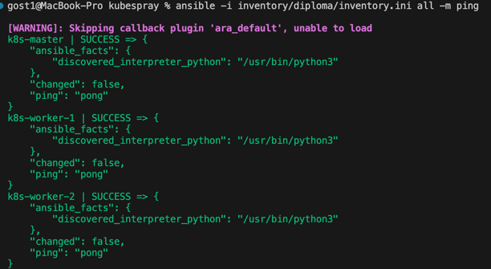
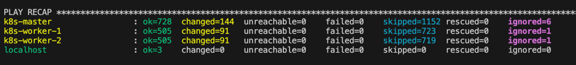
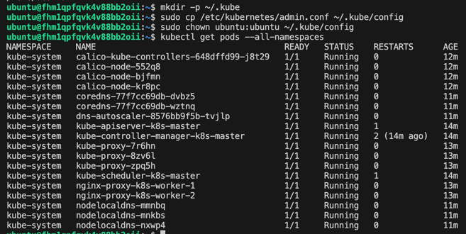
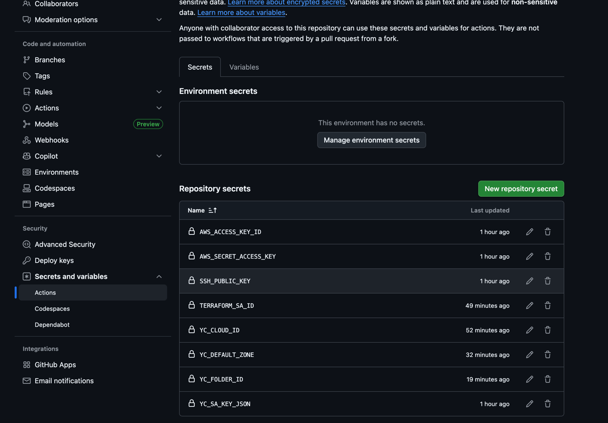
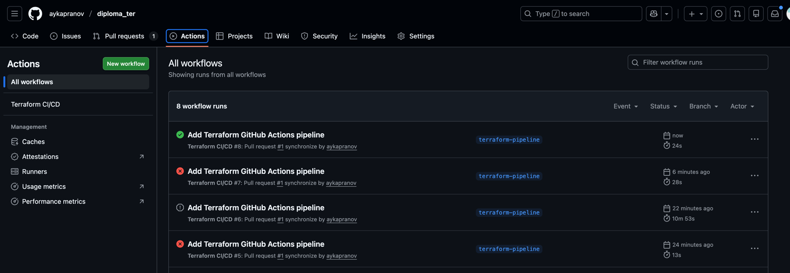
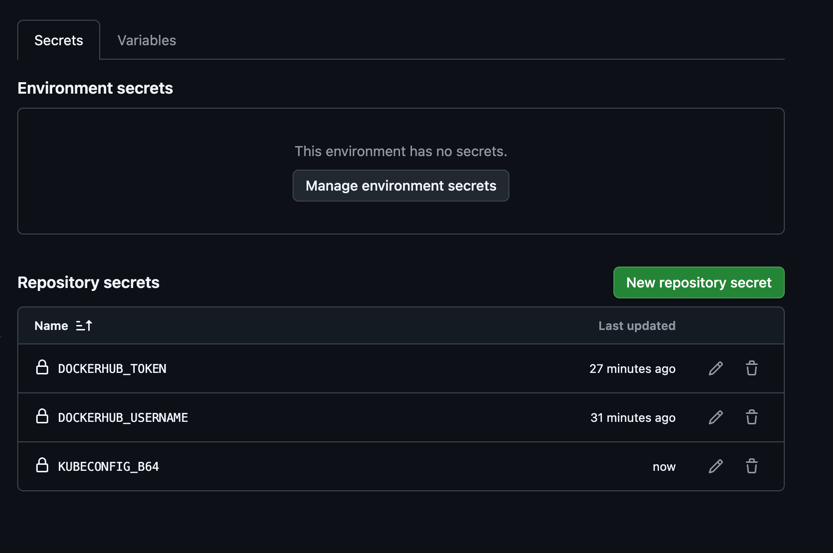
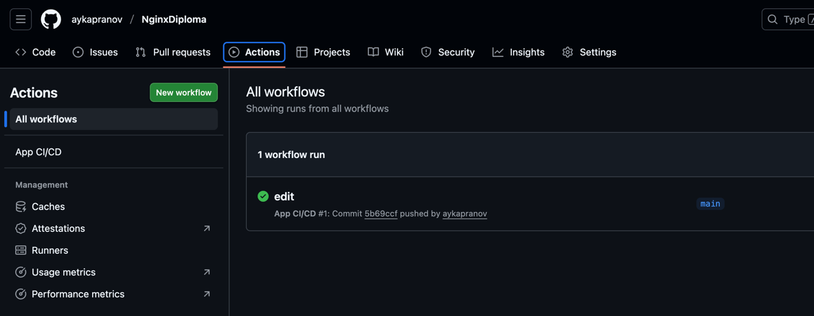
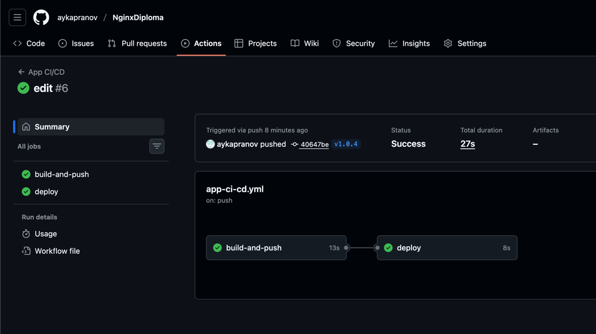
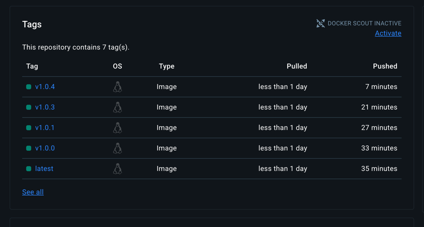
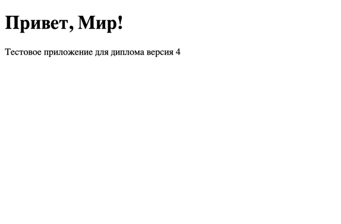

# Доработка 
Терраформ код CICD pipeline https://github.com/aykapranov/diploma_ter/blob/main/.github/workflows/terraform.yml


# Terraform
Структура моего пректа


Для настройки backend я создал `.env` файл и прописал туда 

```
AWS_ACCESS_KEY_ID=XXXXXXXXXXXXX
AWS_SECRET_ACCESS_KEY=XXXXXXXXXXXXX
```
Далее пробрасываем ключи для работы с S3.
```
export $(cat .env | xargs)
terraform init -migrate-state
```


Я создал бакет через terraform и далее повторно сделал `terraform init` c backend.tf, чтоб мигрировал state.

После этого в папке main, где находится основная часть проекта, можно выполнить команды `terraform destroy` и `terraform apply` без дополнительных ручных действий.

# Ansible

Клонируем Kubespray
```commandline
git clone https://github.com/kubernetes-sigs/kubespray.git
```

Устанавливаем зависимости
```commandline
pip install -r requirements.txt
```

Копируем шаблон в inventory
```commandline
cp -rfp inventory/sample inventory/diploma
```

Редактируем `kubespray/inventory/diploma/inventory.ini` и `kubespray/ansible.cfg`

[ansible.cfg](Ansible%2Fansible.cfg)
[inventory.ini](Ansible%2Finventory.ini)

Проверяем через ping виртуальные машины 
```commandline
ansible -i inventory/diploma/inventory.ini all -m ping -u ubuntu
```


Запускаем установку Kubernetes
```commandline
ansible-playbook -i inventory/diploma/inventory.ini \
  --become \
  cluster.yml
```



Настраиваем и проверяем работу кластера
```commandline
mkdir -p ~/.kube
sudo cp /etc/kubernetes/admin.conf ~/.kube/config
sudo chown ubuntu:ubuntu ~/.kube/config
kubectl get pods --all-namespaces
```


Команда `kubectl get pods --all-namespaces` выполняется без ошибок,
что подтверждает корректную работу кластера и системных компонентов.


# Создание тестового приложения
Создаём файлы для приложения

[Dockerfile](nginx-diploma%2FDockerfile)
[index.html](nginx-diploma%2Findex.html)
[nginx.conf](nginx-diploma%2Fnginx.conf)

Подключаем git
```commandline
git init
git add .
git commit -m "Initial commit: nginx test application"
```
Собираем docker образ
```commandline
docker build -t aykapranov/nginx-diploma:1.0 .
```

Публикуем образ в registry (DockerHub)
```commandline
docker login
docker push aykapranov/nginx-diploma:1.0
```

Ссылка на образ в DockerHub
https://hub.docker.com/r/aykapranov/nginx-diploma

Ссылка на проект в github
https://github.com/aykapranov/NginxDiploma/tree/main


# Подготовка cистемы мониторинга и деплой приложения

Устанавливаем Helm на master ноду
```commandline
curl -fsSL https://raw.githubusercontent.com/helm/helm/main/scripts/get-helm-3 | bash
helm version
```

Создаем папку с проектом мониторинга
```
mkdir -p ~/diploma/helm/monitoring
cd ~/diploma/helm/monitoring
```

Установка ingress-nginx
```commandline
helm repo add ingress-nginx https://kubernetes.github.io/ingress-nginx
helm repo update

kubectl create ns ingress-nginx --dry-run=client -o yaml | kubectl apply -f -

helm upgrade --install ingress-nginx ingress-nginx/ingress-nginx \
  -n ingress-nginx
```
Проверка 
```commandline
kubectl -n ingress-nginx get pods -o wide
kubectl -n ingress-nginx get svc
```

Настройка ingress-nginx для работы на 80 порту
```commandline
helm upgrade --install ingress-nginx ingress-nginx/ingress-nginx \
  -n ingress-nginx \
  --set controller.hostNetwork=true \
  --set controller.dnsPolicy=ClusterFirstWithHostNet \
  --set controller.service.type=ClusterIP \
  --set controller.nodeSelector."kubernetes\.io/hostname"=k8s-master \
  --set-string controller.tolerations[0].key="node-role.kubernetes.io/control-plane" \
  --set-string controller.tolerations[0].operator="Exists" \
  --set-string controller.tolerations[0].effect="NoSchedule"
```

Установка kube-prometheus-stack
```commandline
helm repo add prometheus-community https://prometheus-community.github.io/helm-charts
helm repo update

helm show values prometheus-community/kube-prometheus-stack > values.yaml
```

Редактируем `values.yaml`
```commandline
grafana:
  adminPassword: XXXXXXX
  
  service:
    type: ClusterIP
   
  grafana.ini:
    server:
      root_url: "/grafana/"
      serve_from_sub_path: true
      enforce_domain: false
```

```commandline
helm upgrade --install monitoring prometheus-community/kube-prometheus-stack \
  --create-namespace -n monitoring -f values.yaml
```

### Установка мониторинга
Создание Ingress для Grafana [ingress-grafana.yaml](K8S%2Fingress-grafana.yaml)
```commandline
kubectl apply -f ~/diploma/k8s/ingress-grafana.yaml
kubectl -n monitoring get ingress
```

Проверяем, что Grafana работает по адресу http://ip_адрес_мастер_ноды/grafana
```commandline
kubectl -n monitoring get pods
kubectl -n monitoring get svc | grep -i grafana
```

### Деплой nginx приложения
Создаем Namespace
```commandline
kubectl create ns diploma --dry-run=client -o yaml | kubectl apply -f -
```
Deployment моего приложения [nginx-diploma.yaml](K8S%2Fnginx-diploma.yaml)

Запускаем приложение
```commandline
kubectl apply -f ~/diploma/k8s/nginx-diploma.yaml
```

Проверяем, что приложение работает
```commandline
kubectl -n diploma get pods
kubectl -n diploma get svc
```

Создание Ingress для приложения [ingress-nginx-diploma.yaml](K8S%2Fingress-nginx-diploma.yaml)
```commandline
kubectl apply -f ~/diploma/k8s/ingress-nginx-diploma.yaml
kubectl -n diploma get ingress
```

Приложение работает по адресу http://ip_адрес_мастер_ноды


Видим, что в Grafana появилась информация по новому Namespace, где работает наше приложение


Создаем guthub репозиторий и серкеты для работы с terraform
Settings => Actions => Secrets


Инициализация репозитория
```commandline
git add .
git commit -m "Initial commit"
git remote add origin https://github.com/aykapranov/diploma_ter.git
git push -u origin main
```

### Логика работы pipeline
Pull Request в ветку main
- terraform fmt -check
- terraform init
- terraform validate
- terraform plan

Push в ветку main
- terraform init
- terraform apply -auto-approve

Создаём ветку, пушим изменения и создаём PR в main
```commandline
git checkout -b terraform-pipeline
git add .
git commit -m "Add terraform pipeline"
git push -u origin terraform-pipeline
```


### pr-plan проходит успешно



### У меня при apply происходит ошибка.
Я честно, не знаю как её исправить, уже все перепробовал. Не понимаю почему он не видит folder_id.
Прошу зачесть диплом без этой части или подсказать, как можно исправить ощибку
```commandline
yandex_vpc_network.main: Creating...
╷
│ Error: Error getting folder ID while creating network: cannot determine folder_id: please set 'folder_id' key in this resource or at provider level
│ 
│   with yandex_vpc_network.main,
│   on main.tf line 21, in resource "yandex_vpc_network" "main":
│   21: resource "yandex_vpc_network" "main" ***
│ 
╵
Error: Terraform exited with code 1.
Error: Process completed with exit code 1.
```


# Установка и настройка CI/CD

Добавляем секреты в репозиторий github



Создаем в проекте файл `.github/workflows/app-ci-cd.yml` для ci cd
Логика 
push в main 
- build 
- push latest

push tag
- build 
- push vTag
- deploy в k8s

Делаем commit и push в репозиторий
```commandline
git commit -am "Update"
git push
```

В результате CI job зелёный




На master сделаем отдельный kubeconfig специально для CI, чтобы не ломать свой рабочий
```
cp ~/.kube/config ~/kubeconfig-gha
```

Указываем публичный сервер
```
kubectl --kubeconfig ~/kubeconfig-gha config set-cluster cluster.local --server=https://{IP master}:6443
```

Теперь включаем пропуск TLS-проверки и убираем CA (kubectl ругается если оба заданы):
```
kubectl --kubeconfig ~/kubeconfig-gha config set-cluster cluster.local --insecure-skip-tls-verify=true
kubectl --kubeconfig ~/kubeconfig-gha config unset clusters.cluster.local.certificate-authority-data
```

Получаем base64 kubeconfig `cat ~/kubeconfig-gha | base64` для переменной KUBECONFIG_B64

Теперь пушим тег
```commandline
git tag v1.0.4
git push origin v1.0.4
```

deploy успешно прошел


Тег успешно обновлен в dockerhub


Видим, что текст на самой странице обновился 



## Что необходимо для сдачи задания?

1. Репозиторий с конфигурационными файлами Terraform и готовность продемонстрировать создание всех ресурсов с нуля. https://github.com/aykapranov/diploma_ter
2. Пример pull request с комментариями созданными atlantis'ом или снимки экрана из Terraform Cloud или вашего CI-CD-terraform pipeline. https://github.com/aykapranov/diploma_ter/actions
3. Репозиторий с конфигурацией ansible, если был выбран способ создания Kubernetes кластера при помощи ansible. https://github.com/aykapranov/DevOps_Kapranov/tree/main/Diploma/Ansible
4. Репозиторий с Dockerfile тестового приложения и ссылка на собранный docker image. https://github.com/aykapranov/NginxDiploma https://hub.docker.com/r/aykapranov/nginx-diploma
5. Репозиторий с конфигурацией Kubernetes кластера. https://github.com/aykapranov/DevOps_Kapranov/tree/main/Diploma/K8S
6. Ссылка на тестовое приложение и веб интерфейс Grafana с данными доступа. Я пока удалил все ресурсы, так как мой грант давно был исчерпан. Я приложил скрины и можем согласовать время, чтоб я к нему поднял все инфраструктуру и вы посмотрели 


