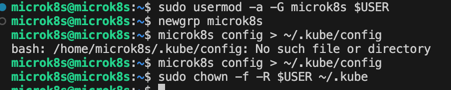
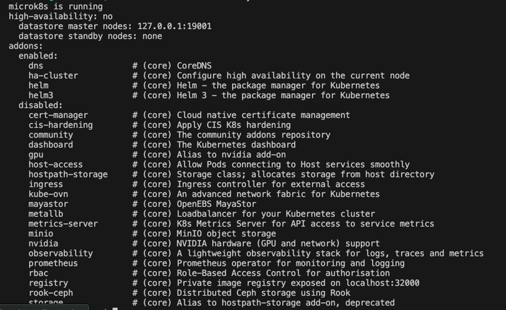
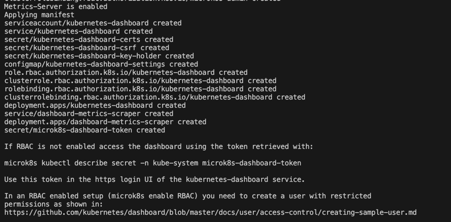
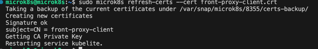
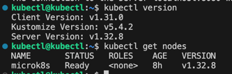
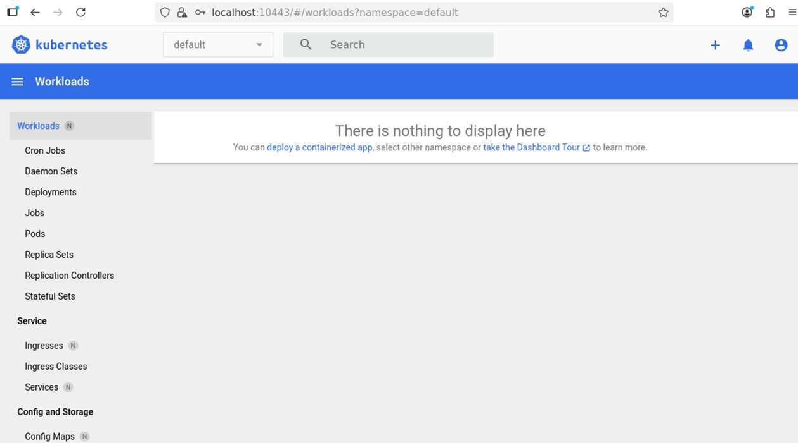

# 1 Задание
```
sudo apt update
sudo apt install -y snapd
sudo snap install microk8s --classic
sudo usermod -a -G microk8s $USER
newgrp microk8s

microk8s config > ~/.kube/config
sudo chown -f -R $USER ~/.kube
```




```
microk8s status --wait-ready
```








# 2 Задание





