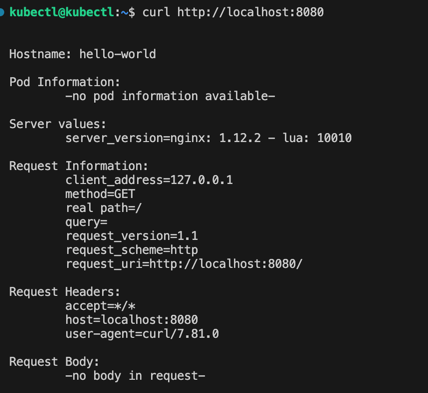
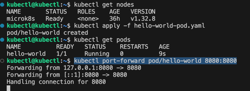
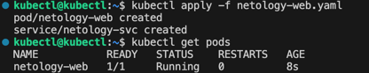
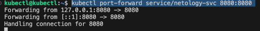
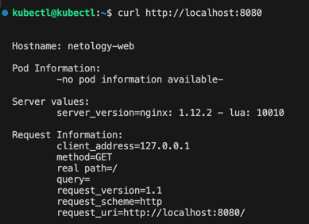

### Задание 1. Создать Pod с именем hello-world

[hello-world-pod.yaml](hello-world-pod.yaml)
```
kubectl apply -f hello-world-pod.yaml
kubectl get pods
kubectl port-forward pod/hello-world 8080:8080
```






### Задание 2. Создать Service и подключить его к Pod

[netology-web.yaml](netology-web.yaml)
```
kubectl apply -f netology-web.yaml
kubectl get pods
kubectl get svc
kubectl port-forward service/netology-svc 8080:8080
```


