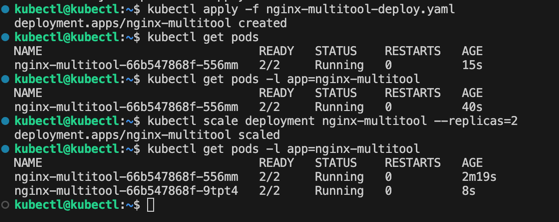
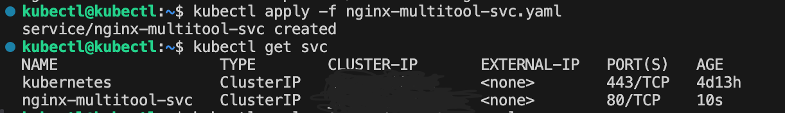
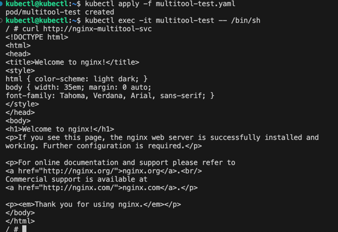
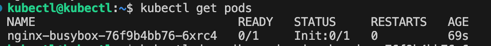
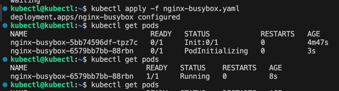

# Задание 1.
```
kubectl apply -f nginx-multitool-deploy.yaml
kubectl get pods -l app=nginx-multitool
kubectl scale deployment nginx-multitool --replicas=2
kubectl get pods -l app=nginx-multitool

kubectl apply -f nginx-multitool-svc.yaml
kubectl get svc

kubectl apply -f multitool-test.yaml
kubectl exec -it multitool-test -- /bin/sh
curl http://nginx-multitool-svc
```
[nginx-multitool-svc.yaml](nginx-multitool-svc.yaml)

[multitool-test.yaml](multitool-test.yaml)

[nginx-multitool-deploy.yaml](nginx-multitool-deploy.yaml)









# Задание 2.

[nginx-busybox.yaml](nginx-busybox.yaml)

[nginx-busybox-svc.yaml](nginx-busybox-svc.yaml)



Мне пришлось изменить свой изначальный nginx-busybox.yaml, так как в первой редакции он не заработал как надо.



