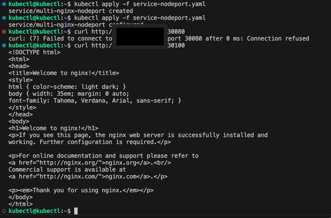

# Задание 1

[deployment-multi-container.yaml](01%2Fdeployment-multi-container.yaml)

[service-nodeport.yaml](01%2Fservice-nodeport.yaml)

[service-clusterip.yaml](01%2Fservice-clusterip.yaml)

# Задание 2
У меня нет своего домена, поэтому я сделал все по ip

[deployment-frontend.yaml](02%2Fdeployment-frontend.yaml)

[deployment-backend.yaml](02%2Fdeployment-backend.yaml)

[service-backend.yaml](02%2Fservice-backend.yaml)

[service-frontend.yaml](02%2Fservice-frontend.yaml)

[ingress.yaml](02%2Fingress.yaml)

