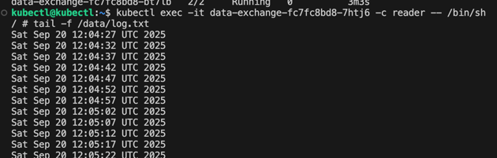
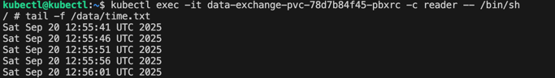
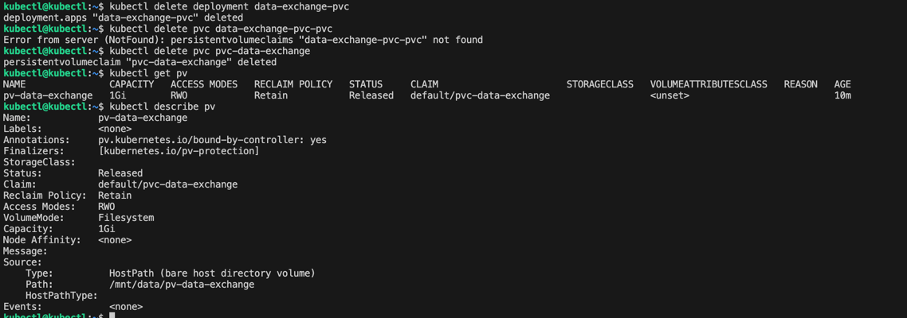
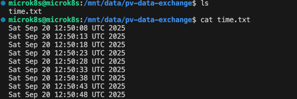
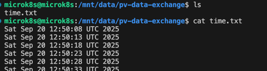
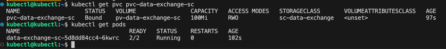
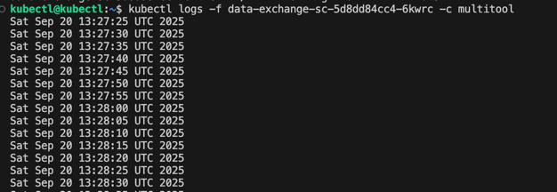

# Задание 1. Volume: обмен данными между контейнерами в поде

[containers-data-exchange.yaml](01%2Fcontainers-data-exchange.yaml)

# Задание 2. PV, PVC

[pv-pvc.yaml ](02%2Fpv-pvc.yaml%20)

PV остаётся в состоянии Released, он отвязан, но не удалён.

Файл остался после удаления PVC

Удаляем PV

В yaml файле указано `persistentVolumeReclaimPolicy: Retain`, поэтому данные остались.

# Задание 3. StorageClass

