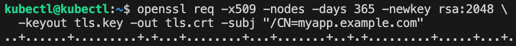
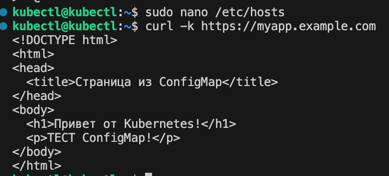
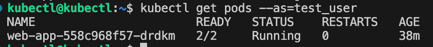

## Задание 1: Работа с ConfigMaps

[configmap-web.yaml](01%2Fconfigmap-web.yaml)

[deployment.yaml](01%2Fdeployment.yaml)

## Задание 2: Настройка HTTPS с Secrets

[secret-tls.yaml](02%2Fsecret-tls.yaml)

[ingress-tls.yaml](02%2Fingress-tls.yaml)

## Задание 3: 

[role-pod-reader.yaml](03%2Frole-pod-reader.yaml)

[rolebinding-developer.yaml](03%2Frolebinding-developer.yaml)

