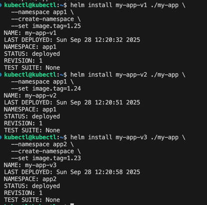

### Задание 1. Подготовить Helm-чарт для приложения
[Chart.yaml](01%2FChart.yaml)

[deployment.yaml](01%2Fdeployment.yaml)

[values.yaml](01%2Fvalues.yaml)

### Задание 2. Запустить две версии в разных неймспейсах

