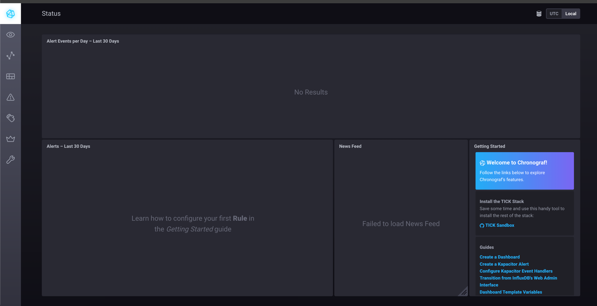
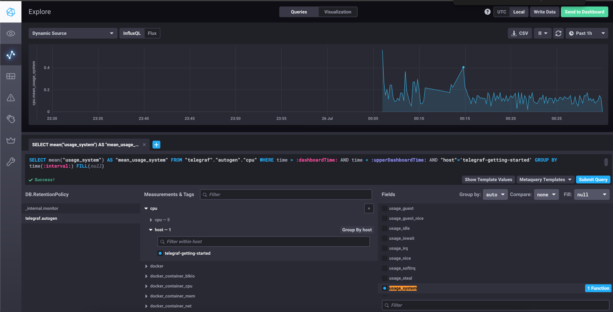
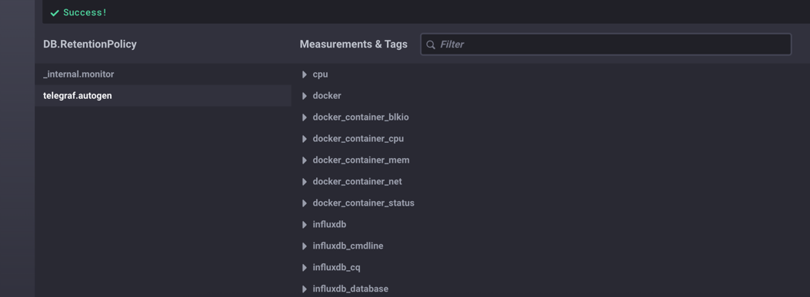

1. Минимальный набор метрик в мониторинге:
   - CPU LA - Так как вычисления загружают ЦПУ.
   - IOPS, inodes и FS - Так как отчёты сохраняются на диск.
#
2. На запрос менеджера продукта я бы настроил мониторинг:
   - Среднее и 95-й перцентиль времени ответа.
   - Время генерации отчета.
   - SLI.
#
3. Я бы предложил использовать open-source решения, если это не противоречит политике безопасности или рассмотреть инструменты, которые уже есть в кампании. 
#
4. Возможно в системе есть другие коды ответ. Например 301, 302.

### 5. Задание
#### push-модели:
Плюсы:
- Упрощение репликации данных в разные системы мониторинга или их резервные копии
- Более гибкая настройка отправки пакетов данных с метриками
- UDP — это менее затратный способ передачи данных, из-за чего может возрасти производительность сбора метрик

Минусы:
- Сложнее отлаживать
- Повышенные требования к настройке агентов

#### pull-модели
Плюсы:
- Легче контролировать подлинность данных
- Можно настроить единый proxy server до всех агентов с TLS
- Упрощённая отладка получения данных с агентов

Минусы:
- Не подходит для агентов в закрытых сетях без проброса портов
- Менее эффективна при большом количестве агентов
#
### 6. Задание
   - Prometheus (pull-модель)
   - TICK (push-модель)
   - Zabbix (гибрид)
   - VictoriaMetrics (pull-модель)
   - Nagios (гибрид)
#
7. 

#
8.

#
9.
