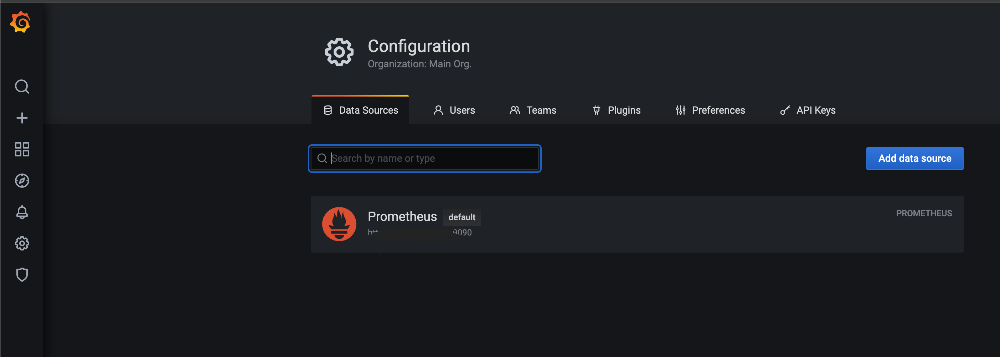
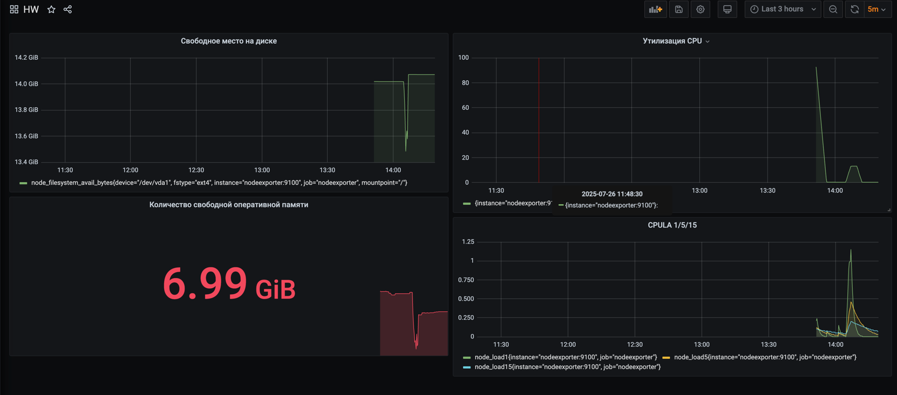
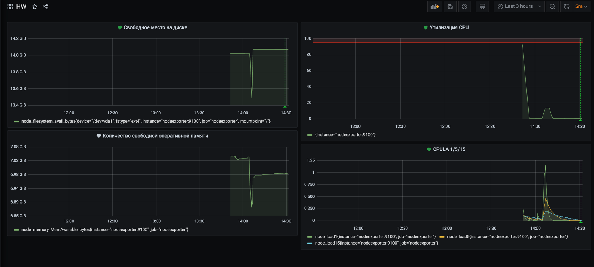

## Задание 1


## Задание 2
Свободное место на диске
`node_filesystem_avail_bytes{mountpoint="/", fstype!="tmpfs", fstype!="overlay"}`

Утилизация CPU 
`100 - (avg by(instance) (rate(node_cpu_seconds_total{mode="idle"}[5m])) * 100)`

Количество свободной оперативной памяти
`node_memory_MemAvailable_bytes`

CPULA 1/5/15
```
node_load1
node_load5
node_load15
```





## Задание 3




## Задание 4
[grafana_dashboard.json](grafana_dashboard.json)