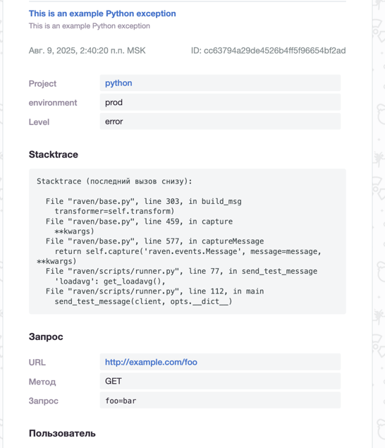

### Задание 1

### Задание 2
Кнопки "Generate sample event" в интерфейсе Sentry больше нет.
Я получил уведомление подключив python проект к Sentry и вызвав ошибку в коде.

### Задание 3
В алертинге Sentry я настроил оповещение по email, которое приходит при возникновении ошибки в проекте.

