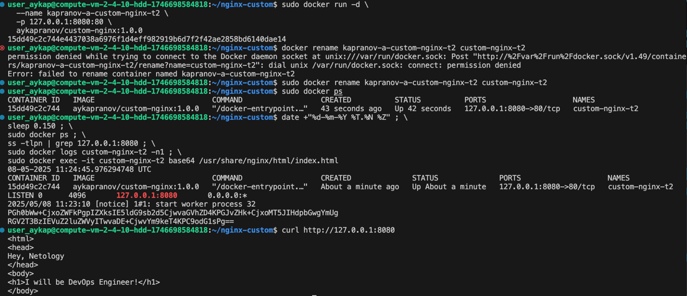
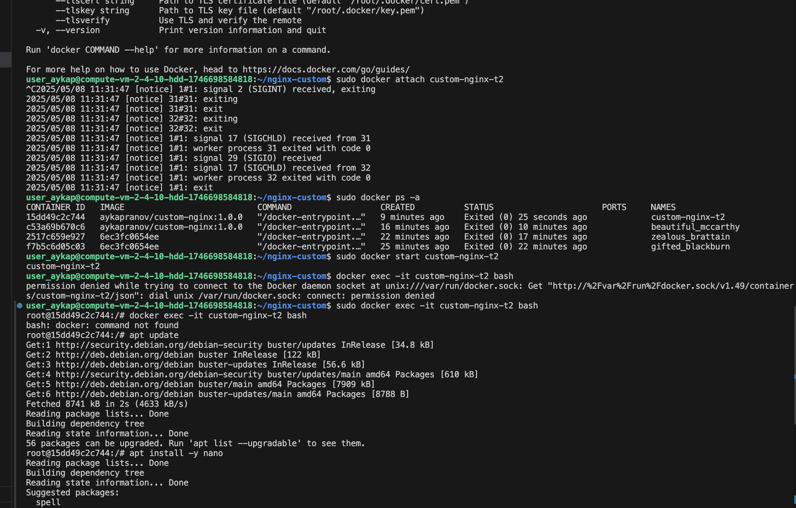
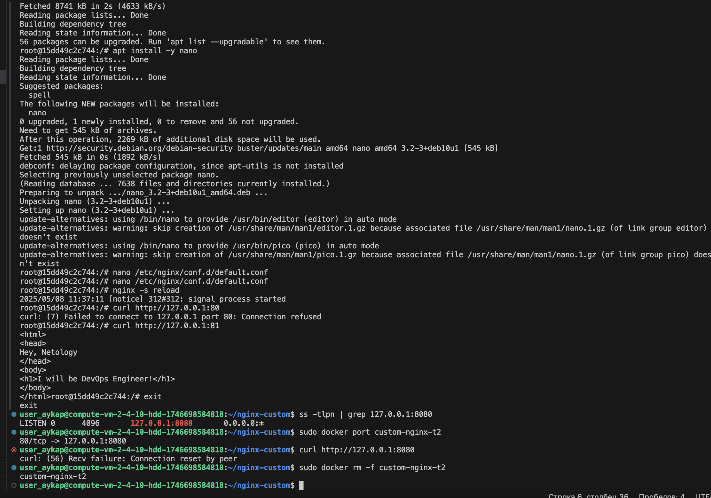
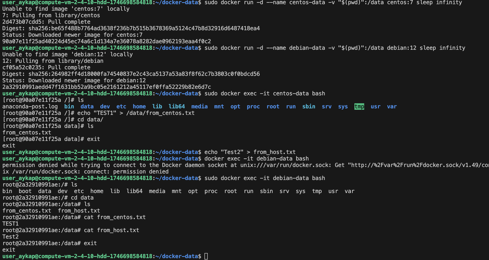
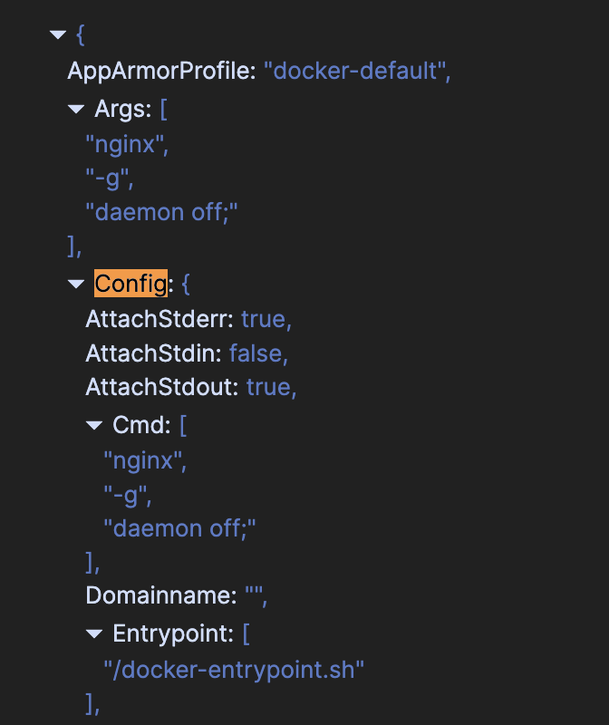
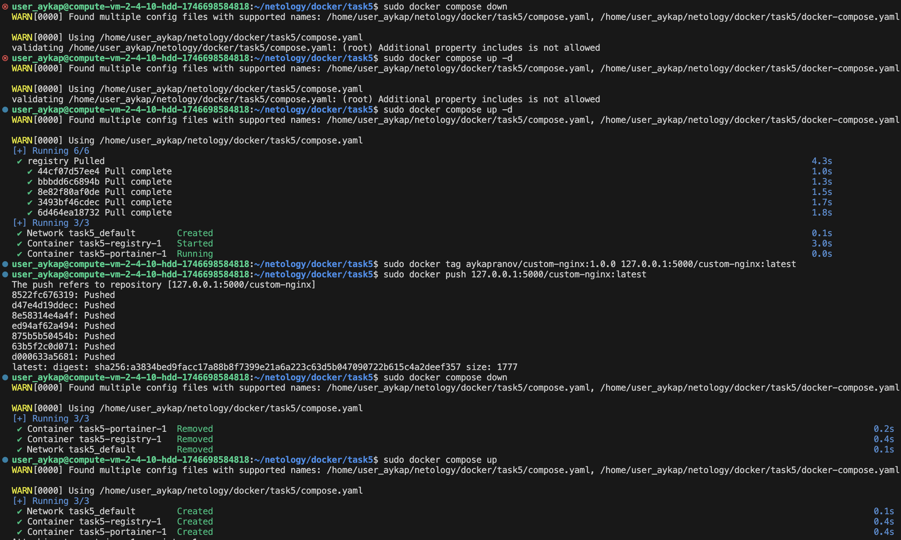
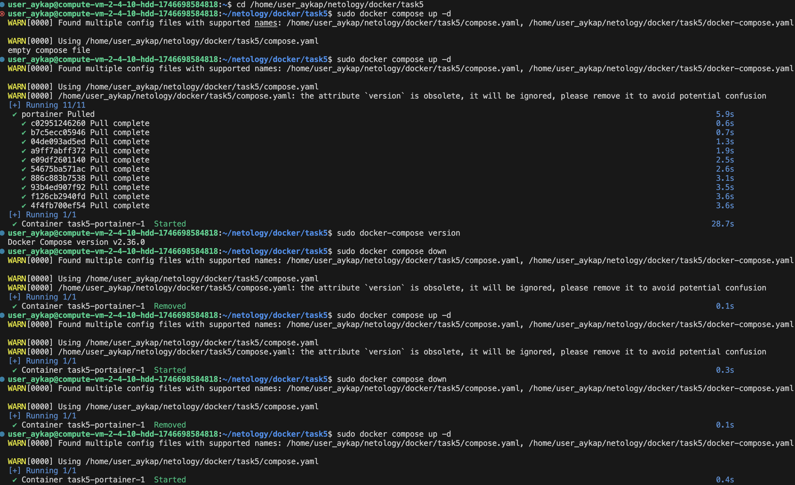

# Задание 1
https://hub.docker.com/repository/docker/aykapranov/custom-nginx/tags/1.0.0/sha256-a3834bed9facc17a88b8f7399e21a6a223c63d5b047090722b615c4a2deef357

# Задание 2

# Задание 3

- Когда мы жмем Ctrl-C, то посылаешь сигнал SIGINT и основной процесс внутри контейнера завершает работу.
- После редактирования default.conf, nginx слушает 81, но наружу он не проброшен, поэтому curl http://127.0.0.1:8080 не работает

# Задание 4

# Задание 5

Путь по умолчанию для файла Compose — compose.yaml

