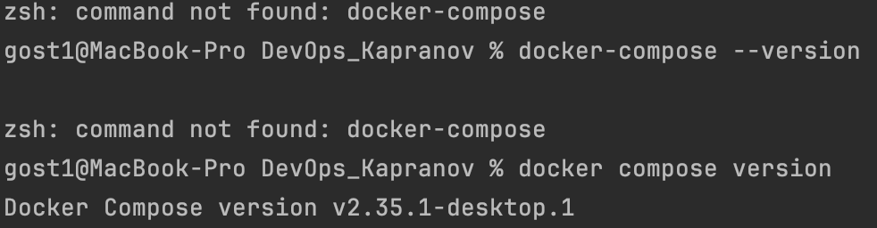
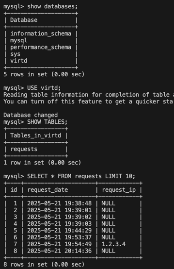
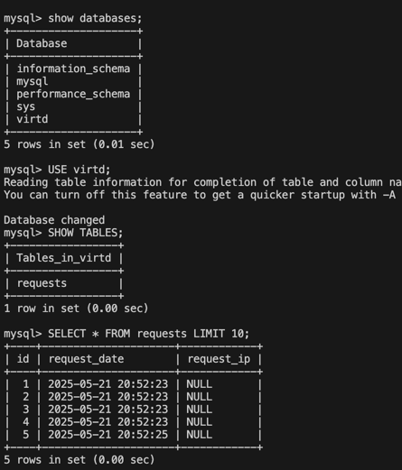
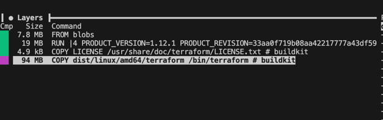
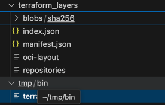
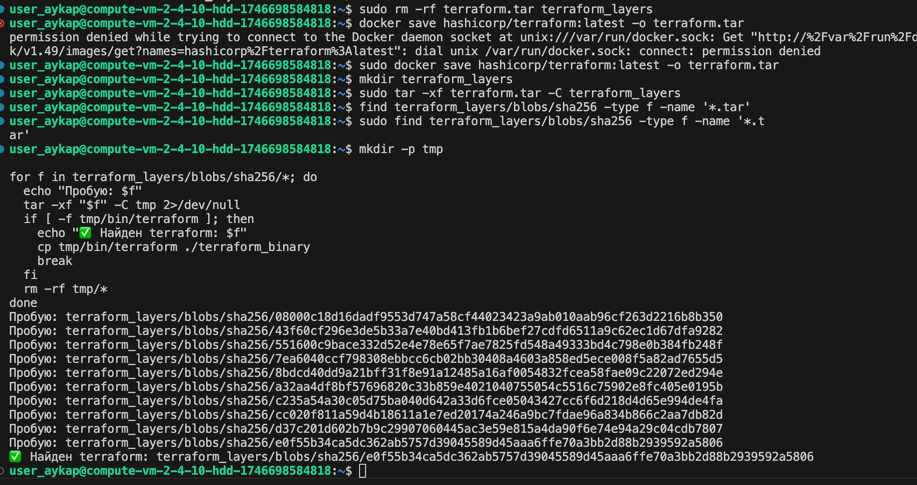
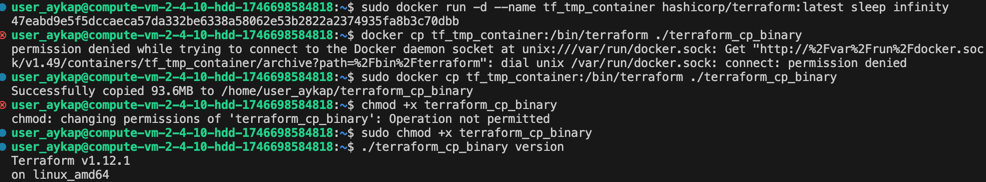

# Задание 0

# Задание 1
https://github.com/aykapranov/shvirtd-example-python

# Задание 3 
У меня не получилось запустить проект на порту 8090, ошибка, что он уже занят. Я честно пытался её победить, но не смог =(

# Задание 4 

# Задание 6

# Задание 6.1
