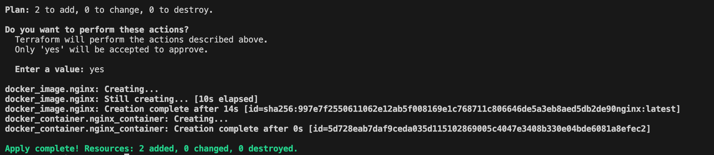
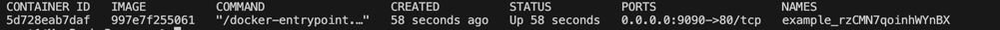
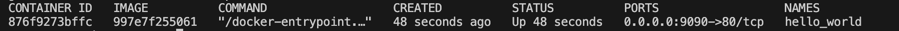
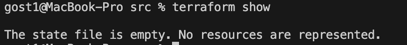

# Задание 1 

### 2.
Допустимо хранить секреты в personal.auto.tfvars

### 3.
"result": "mhBTW7oredmWYbAD"

### 4.
Две ошибки:
Error: Missing name for resource
Все блоки ресурсов должны иметь тип и имя

Error: Invalid resource name
Имя не может начинаться с цифры

Reference to undeclared resource
Ресурс random_password.random_string_FAKE не существует, правильно использовать random_password.random_string.result

### 5.
```commandline
terraform {
  required_providers {
    docker = {
      source  = "kreuzwerker/docker"
      version = "~> 3.0.1"
    }
  }
  required_version = ">=1.8.4" /*Многострочный комментарий.
 Требуемая версия terraform */
}
provider "docker" {}

#однострочный комментарий

resource "random_password" "random_string" {
  length      = 16
  special     = false
  min_upper   = 1
  min_lower   = 1
  min_numeric = 1
}


resource "docker_image" "nginx" {
  name         = "nginx:latest"
  keep_locally = true
}

resource "docker_container" "nginx_container" {
  image = docker_image.nginx.image_id
  name  = "hello_world"

  ports {
    internal = 80
    external = 9090
  }
}
```





### 6.
Ключ -auto-approve опасно использовать, так как можно случайно удалить или перезапустить ресурсы, так как мы не видим планируемых изменений
в инфраструктуре.
Но он может быть полезен в CI/CD, где нет возможности ввода.



### 7.


### 8.
Образ не был удален из-за keep_locally = true.
Он говорит, что образ из локального Docker не будет удален после команды terraform destroy

Текст из документации:
keep_locally (Boolean) If true, then the Docker image won't be deleted on destroy operation. If this is false, it will delete the image from the docker local storage on destroy operation.
