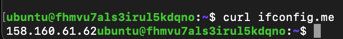
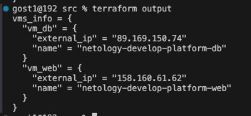

# Задание 1
Ошибка была в 
- platform_id = "standart-v4".
- Не верно указаны параметры ВМ
- Не указана zone
- Не указан размер диска 'size'

preemptible - Говорит, что машина прерываемая, что позволяет сэкономить на стоимости, но она может быть остановлена в любой момент после 24 часов с момента запуска.
core_fraction - Процент от одного ядра, который будет выделен для этой машины. Это позволяет использовать меньше ресурсов и экономить.

# Задание 2
Добавил переменные в variables.tf

# Задание 4

Все файлы, в которых я работал, находятся в папке ter2.